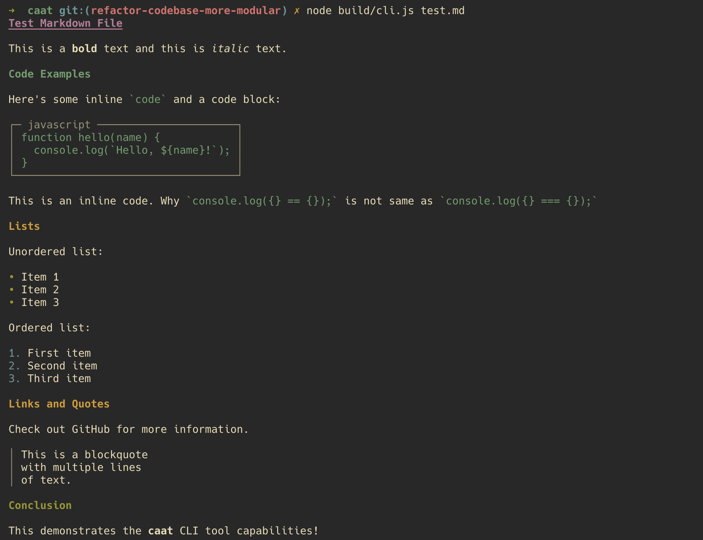

# caat


A modular CLI tool written in TypeScript that converts various file formats to beautifully styled terminal output with colors and formatting.



Why **caat**? Just like the Unix `cat` command concatenates and displays files, **caat** (Cat-like Advanced Appearance Tool) takes it a step further by elegantly displaying your files with style! 🐱 It's the purr-fect alternative to plain `cat` for reading various file formats - because who wants to stare at raw content when you can have rainbow-colored, properly formatted output? 🌈✨

## Installation

Install globally via https://www.npmjs.com/package/@slowcode/caat

```bash
npm install -g @slowcode/caat
```

## Usage

```bash
caat <file>
```

### Examples

```bash
# Display a README file
caat README.md

# Display any supported file
caat docs/guide.md
```

## Features

### Markdown Support
- ✨ Styled headings with different colors (H1-H6)
- 📝 Formatted paragraphs and text
- 💻 Syntax-highlighted code blocks
- 🔗 Clickable links with URLs
- 📋 Styled lists (ordered and unordered)
- 📖 Formatted blockquotes
- **Bold** and *italic* text support
- `Inline code` highlighting

## Requirements

- Node.js >= 16.0.0

## Contributing

Contributions are welcome! CAAT's modular architecture makes it easy to add support for new file formats.

### Adding a New Parser

Want to add support for a new file format? Check out our [Contributing Guide](CONTRIBUTING.md) for detailed instructions on:

- Creating new parser modules
- Parser architecture and requirements
- Testing and submission process
- Examples of potential parsers (JSON, CSV, YAML, etc.)

### Development Setup

**For TypeScript development**:
   ```bash
   npm install
   npm run build    # Compile TypeScript to JavaScript
   npm run cli      # Build and run CLI
   npm test         # Build and test with markdown file
   ```

**Test the CLI locally**:
   ```bash
   npm install
   npm test
   node build/cli.js test.md # read markdown file using caat
   ```

### Making Changes

Follow [GitHub's open source contribution guidelines](https://docs.github.com/en/get-started/quickstart/contributing-to-projects) for best practices.

### Release Process

1. **Update version and push**:
   ```bash
   npm run release:patch  # for bug fixes (1.0.0 → 1.0.1)
   npm run release:minor  # for new features (1.0.0 → 1.1.0)
   npm run release:major  # for breaking changes (1.0.0 → 2.0.0)
   ```

2. **Create a GitHub release**:
   - Go to GitHub > Releases > Create a new release
   - Use the git tag created by npm version (e.g., `v1.0.2`)
   - The CI/CD pipeline will automatically use the release tag version for npm publishing

## License

MIT
